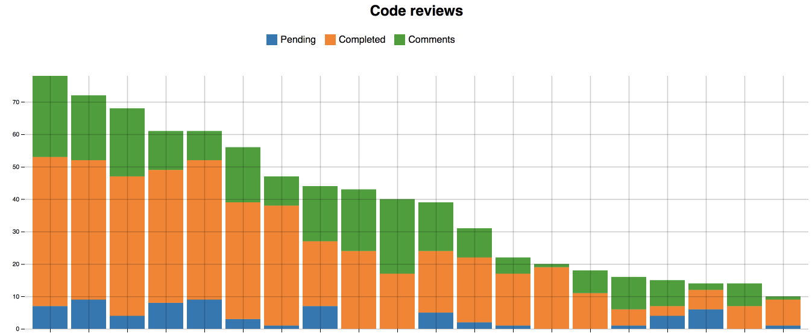

# Github Reviewer Graph
Graphing data from Github's [GraphQL API](https://developer.github.com/v4/)


* real version shows usernames

## Config
- Copy `config.default.js` into a file called `config.js`, and add your personal access token

## Developing
```sh
yarn start
```
